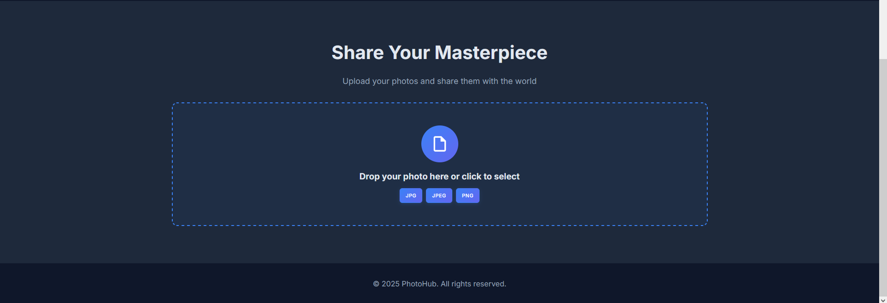

<h1 align="center"> 🖼️ ImageHub 🖼️ </h1>

<!-- BADGES -->
<p align="center">
  
  
</p>

<!-- INFORMATION -->
<h1 align="left"> 📘 About</h1>


**ImageHub** is a feature-rich platform for uploading, managing, and retrieving images with tiered subscription plans (Basic, Premium, Enterprise, and custom plans). Built with **Django REST Framework** for the backend and a responsive frontend (HTML, CSS, JS with AJAX), it includes user registration with email verification, task queuing with Celery, caching with Redis, and production-ready deployment with Nginx and Flower for monitoring.

- **Backend**: [**`Django REST Framework`**](https://www.django-rest-framework.org/) + [**`Django`**](https://www.djangoproject.com/)
- **Frontend**: HTML, CSS, JavaScript with **AJAX** for seamless interaction
- **Database**: [**`PostgreSQL`**](https://www.postgresql.org/)
- **Task Queue**: [**`Celery`**](https://docs.celeryproject.org/) + [**`Celery Beat`**](https://docs.celeryproject.org/en/stable/userguide/periodic-tasks.html)
- **Caching**: [**`Redis`**](https://redis.io/)
- **Image Processing**: [**`Pillow`**](https://python-pillow.org/)
- **Web Server**: [**`Nginx`**](https://nginx.org/) + [**`Gunicorn`**](https://gunicorn.org/)
- **Monitoring**: [**`Flower`**](https://flower.readthedocs.io/) for Celery tasks
- **Containerization**: [**`Docker`**](https://www.docker.com/) with **Docker Compose**

<!-- IMAGES -->
## 🖼️ Gallery




<!-- FEATURES -->
## 🚀 Features
- **User Registration**: Sign up with email verification; all users start with the **Basic** plan.
- **Image Upload**: Upload PNG/JPG images via API (`/api/images/upload/`) or a user-friendly AJAX-based frontend.
- **Tiered Plans**:
  - **Basic**: Access to 200px thumbnail.
  - **Premium**: Access to 200px and 400px thumbnails + original image.
  - **Enterprise**: All Premium features + expiring binary image links (300–30,000 seconds).
  - **Custom Plans**: Admins can create plans with custom thumbnail sizes, original image access, and expiring links via Django Admin.
- **Frontend**: Responsive interface (HTML, CSS, JS) with AJAX for uploading images, viewing user galleries, and generating expiring links.
- **Performance**: Optimized with Redis caching and Celery for asynchronous image processing.
- **Testing**: Comprehensive unit tests for API, frontend, and backend logic using **pytest**.
- **Admin Interface**: Manage users, plans, and thumbnails via Django Admin.
- **Monitoring**: Flower dashboard for Celery task monitoring.
- **API**: Fully functional REST API with Swagger documentation.

<table align="center">
   <tr>
      <th align="center">
         <sup>:warning: IMPORTANT :warning:</sup>
      </th>
   </tr>
   <tr>
      <td align="center">
        Ensure Docker, Docker Compose, and Redis are installed for setup.<br>
        The default database is PostgreSQL; configure it in <code>docker-compose.yml</code>.<br>
        Email verification requires an SMTP server (configure in <code>settings.py</code>).<br>
        For custom plans, use the Django Admin panel to set thumbnail sizes and link options.<br>
        Report issues in the Issues tab.
      </td>
   </tr>
</table>

<!-- INSTALLATION -->
## 📚 Installation
1. **Clone the repository:**
   ```bash
   git clone https://github.com/f1zzye/image-hosting.git
   cd image-hosting
   ```

2. **Create and configure the `.env` file:**  
   Copy `.env.example` to `.env` and fill in all required environment variables (e.g., for PostgreSQL, Redis, SMTP email, Django secrets, etc.).
   
3. **Build and start all services with Docker Compose:**
   ```bash
   docker-compose up --build -d
   ```
   > The `-d` flag runs the containers in detached mode (in the background).
   >
   > To view logs at any time, use:
   > ```bash
   > docker-compose logs -f

5. **Create the initial Django superuser (admin account):**
   ```bash
   docker-compose exec backend python manage.py createsuperuser
   ```

6. **(Optional) Lload fixture data for tariffs manually (if needed):**
   ```bash
   docker-compose exec backend python manage.py loaddata <path_to_fixture_files>
   ```
4. Access:
   - Frontend: http://localhost/
   - API: http://localhost/api/
   - Admin panel: http://localhost/admin/ (create superuser with `docker-compose exec web python manage.py createsuperuser`)
   - Flower: http://localhost:5556/


## 🛠️ Usage
- **Sign Up:**  
  Register a new account at `/user/sign-up/` with email verification. Once activated, you are assigned the Basic plan by default.
- **View Available Tariffs:**  
  Explore pricing and available plans at `/pricing/`.
- **Upgrade Plan:**  
  Upgrade your subscription via `/billing/update-tariff/<tariff_id>/<new_plan>/` (typically triggered from your profile or pricing page).
- **Upload Image:**  
  Upload PNG/JPG images through the frontend at `/upload/` (AJAX-powered), or via the API at `POST /api/images/`.
- **View Images:**  
  Access your personal gallery at `/profile/` (frontend) or list your images via the API at `GET /api/images/`.
- **Temporary/Expiring Links (Enterprise/custom plans):**  
  Generate a temporary download link for an image at `/images/create-temporary-link/`, or access a file via `/images/temporary-link/<uuid:link_id>/`.
- **Download Permissions:**  
  API endpoint `/api/images/<uuid:image_id>/download/` checks if you have permission to download a given image.
- **Admin Panel:**  
  Manage users, plans, and images at `/admin/` (requires admin privileges).
- **API Documentation:**  
  Explore and test all API endpoints via the Swagger UI at `/api/docs/`.

## 🛡️ Post-installation Fixes
- **Email Verification Fails**: Check SMTP settings in `.env` and ensure the server is running.
- **Redis Connection Issues**: Verify Redis is running (`docker-compose logs redis`) and matches `.env` settings.
- **Image Processing Errors**: Ensure Pillow is installed and only PNG/JPG images are uploaded.
- **Frontend AJAX Errors**: Check browser console; ensure API is accessible at `/api/`.
- **Celery Tasks Fail**: Monitor via Flower (`http://localhost:5555`) and check logs (`docker-compose logs celery`).
- **Custom Plan Issues**: Ensure thumbnail sizes are positive integers in the admin panel.
- **Other Issues**: Check logs (`docker-compose logs`) and report bugs in the Issues tab.

## 💻 API Endpoints
- `POST /api/auth/jwt/create/` — Obtain JWT token (user login, via djoser).
- `POST /api/auth/jwt/refresh/` — Refresh JWT token.
- `POST /api/auth/jwt/verify/` — Verify JWT token.
- `GET /api/images/` — List user's images.
- `POST /api/images/` — Upload a new image.
- `GET /api/images/{id}/` — Retrieve details for a specific image.
- `DELETE /api/images/{id}/` — Delete an image.
- `GET /api/tariffs/` — List all available tariff plans.
- `GET /api/user-tariffs/` — View the current user's tariff plan.
- `GET /api/status/` — API health check.
- `GET /api/docs/` — Swagger/OpenAPI documentation.

## 💻 Frontend Navigation
- **Home**: `/` — Main landing page with general overview and sign-up link.
- **Sign In**: `/user/sign-in/` — Log in to your account.
- **Sign Out**: `/user/sign-out/` — Log out of your account.
- **Account Activation**: `/user/activate/<uidb64>/<token>/` — Activate your account via emailed activation link.
- **Profile**: `/profile/` — View your uploaded images and manage expiring links (if implemented in your core app).
- **Upload Image**: `/upload/` — Upload new images using AJAX (if you have a dedicated upload page; otherwise, describe how upload is triggered).
- **Image Delete**: `/images/delete-image/` — Delete an image (endpoint; normally triggered via a button in dashboard/gallery).
- **Create Temporary Link**: `/images/create-temporary-link/` — Generate an expiring download link for your image.
- **Access Temporary Link**: `/images/temporary-link/<uuid:link_id>/` — Download an image via a temporary link.
- **Download Permissions Check**: `/api/images/<uuid:image_id>/download/` — API endpoint to check if a user can download a particular image.
- **Pricing**: `/pricing/` — View all available (and custom) tariff plans.
- **Upgrade Plan**: `/billing/update-tariff/<tariff_id>/<new_plan>/` — Change your subscription plan (available via a button in profile/pricing UI).
- **Contact Us**: `/contacts/` — Contact page for support and feedback.
- **API Docs**: `/api/docs/` — Swagger UI for exploring the API.
