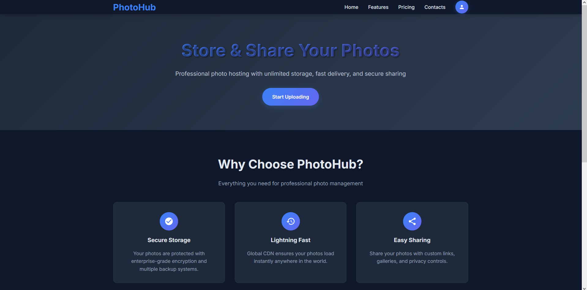

<h1 align="center"> 🖼️ ImageHub 🖼️ </h1>

<!-- BADGES -->
<p align="center">
  
  
  
</p>

<!-- INFORMATION -->
<h1 align="left"> 📘 About</h1>



**ImageHub** is a feature-rich platform for uploading, managing, and retrieving images with tiered subscription plans (Basic, Premium, Enterprise, and custom plans). Built with **Django REST Framework** for the backend and a responsive frontend (HTML, CSS, JS with AJAX), it includes user registration with email verification, task queuing with Celery, caching with Redis, and production-ready deployment with Nginx and Flower for monitoring.

- **Backend**: [**`Django REST Framework`**](https://www.django-rest-framework.org/) + [**`Django`**](https://www.djangoproject.com/)
- **Frontend**: HTML, CSS, JavaScript with **AJAX** for seamless interaction
- **Database**: [**`PostgreSQL`**](https://www.postgresql.org/)
- **Task Queue**: [**`Celery`**](https://docs.celeryproject.org/) + [**`Celery Beat`**](https://docs.celeryproject.org/en/stable/userguide/periodic-tasks.html)
- **Caching**: [**`Redis`**](https://redis.io/)
- **Image Processing**: [**`Pillow`**](https://python-pillow.org/)
- **Web Server**: [**`Nginx`**](https://nginx.org/) + [**`Gunicorn`**](https://gunicorn.org/)
- **Monitoring**: [**`Flower`**](https://flower.readthedocs.io/) for Celery tasks
- **Containerization**: [**`Docker`**](https://www.docker.com/) with **Docker Compose**

<!-- IMAGES -->
## 🖼️ Gallery


<!-- FEATURES -->
## 🚀 Features
- **User Registration**: Sign up with email verification; all users start with the **Basic** plan.
- **Image Upload**: Upload PNG/JPG images via API (`/api/images/upload/`) or a user-friendly AJAX-based frontend.
- **Tiered Plans**:
  - **Basic**: Access to 200px thumbnail.
  - **Premium**: Access to 200px and 400px thumbnails + original image.
  - **Enterprise**: All Premium features + expiring binary image links (300–30,000 seconds).
  - **Custom Plans**: Admins can create plans with custom thumbnail sizes, original image access, and expiring links via Django Admin.
- **Frontend**: Responsive interface (HTML, CSS, JS) with AJAX for uploading images, viewing user galleries, and generating expiring links.
- **Performance**: Optimized with Redis caching and Celery for asynchronous image processing.
- **Testing**: Comprehensive unit tests for API, frontend, and backend logic using **pytest**.
- **Admin Interface**: Manage users, plans, and thumbnails via Django Admin.
- **Monitoring**: Flower dashboard for Celery task monitoring.
- **API**: Fully functional REST API with Swagger documentation.

**Detailed documentation**: [EN](Docs/features_english.md)

<table align="center">
   <tr>
      <th align="center">
         <sup>:warning: IMPORTANT :warning:</sup>
      </th>
   </tr>
   <tr>
      <td align="center">
        Ensure Docker, Docker Compose, and Redis are installed for setup.
        The default database is PostgreSQL; configure it in `docker-compose.yml`.
        Email verification requires an SMTP server (configure in `settings.py`).
        For custom plans, use the Django Admin panel to set thumbnail sizes and link options.
        Report issues in the Issues tab.
      </td>
   </tr>
</table>

<!-- INSTALLATION -->
## 📚 Installation
1. Clone the repository:
   ```bash
   git clone https://github.com/your-username/imagehub.git
   cd imagehub
2. Set up environment variables in .env (see .env.example for SMTP, Redis, etc.).
3. Start with Docker Compose:
   ```bash
   docker-compose up --build
4. Access:
   • Frontend: http://localhost:80/
